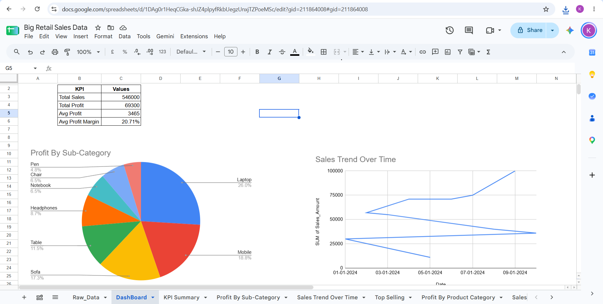
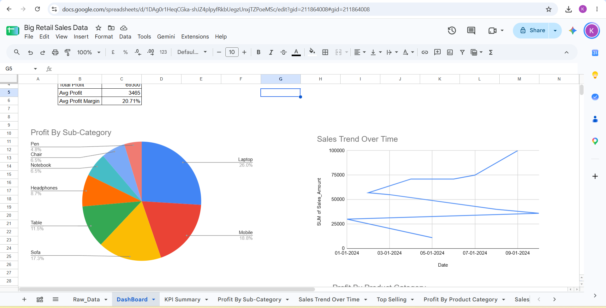
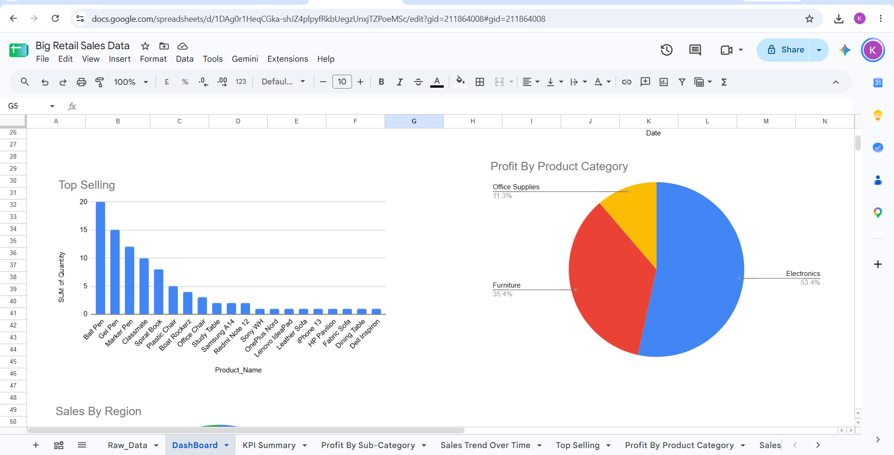
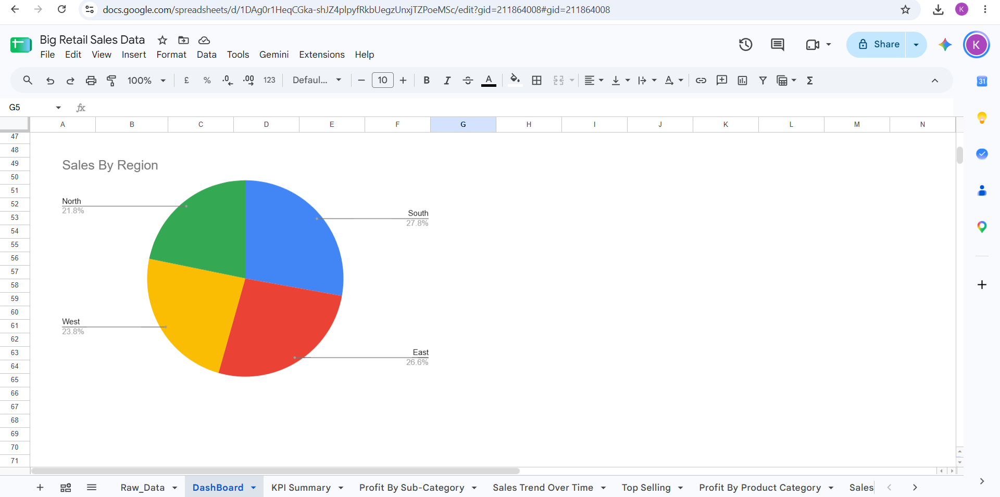

# Big Retail Sales Data Analysis

An end-to-end retail data analytics project analyzing product sales, profit margins, and purchasing trends using Google Sheets and Excel.

🔗 **[Click Here to View Live Google Sheet Project](https://docs.google.com/spreadsheets/d/1DAg0r1HeqCGka-shJZ4plpyfRkbUegzUnxjTZPoeMSc/edit?usp=drivesdk)

## 📊 Dashboard Preview

## 📌 Key Business Insights
- Evaluated sales and purchase amounts across multiple product categories and sub-categories.
- Tracked profit margin percentage across Electronics, Furniture, and Office Supplies.
- Monitored order volume and regional demand trends.

## 🛠️ Tools & Skills
- Google Sheets / Microsoft Excel
- Pivot Tables & KPI Summaries
- Profit Margin & Variance Calculations
- Trend & Category-level Visualizations
